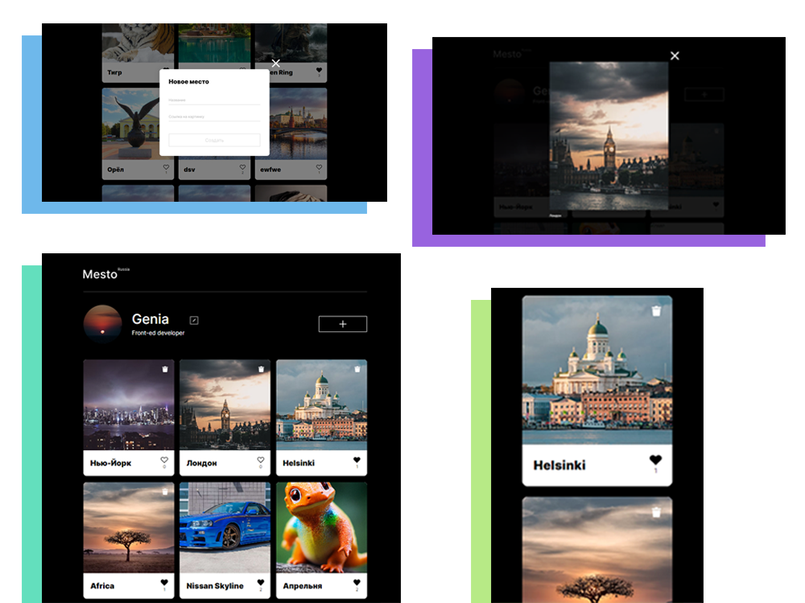

#  Проект “MESTO”
**[Ссылка на проект](https://geniav.github.io/mesto-project/index.html)**

**ЦЕЛЬ ПРОЕКТА**
Отработать знания HTML и CSS на практике, применить JavaScript для добавления функционала, использовать Webpack для сборки проекта, поработать с API.

**STACK**
HTML, CSS, JavaScript, Webpack.

**ОПИСАНИЕ**
**Учебный проект** для добавления карточек любимых мест или мест, где побывал.

Верстка адаптирована под устройства с шириной экрана **1280px** и **320px**.

В проекте реализован удобный и простой для пользователя интерфейс. **Для добавления карточки** необходимо нажать на кнопку со знаком "плюс", ввести название, указать ссылку на изображение и нажать создать.

В проекте настроена **работа с сервером** _(карточки получаются, создаются, удаляются, проставляются лайки карточкам, удаляются лайки у карточек)_.

В проекте на языке JavaScript написан функционал:
* открытие/закрытие попапов
* открытие увеличенного изображения
* изменение данных профиля пользователем
* создание новых карточек пользователем
* удаление карточек (возможно удаление только карточек самого пользователя, чужие карточки нельзя удалять)
* проставление лайка карточкам
* удаление лайка у карточки
* изменение аватара
* валидация форм

**ЗАПУСК ПРОЕКТА**
```sh
npm i
npm run dev
```


